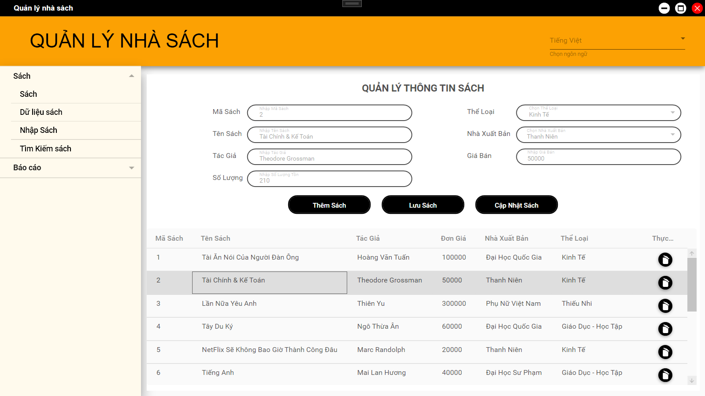
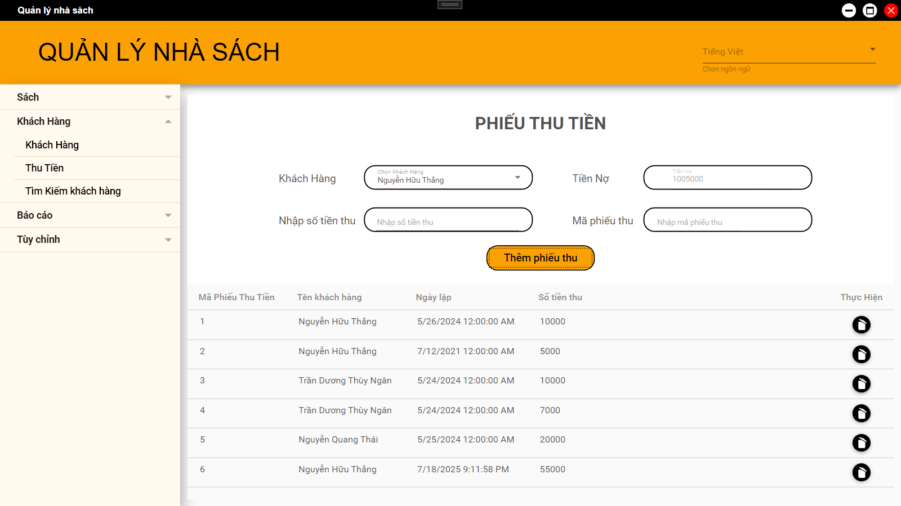

Bookstore Management
## Bookstore Management - NAME STORE

## 📘 Project Overview

<p align="center">
  
</p>

This is a **desktop application** developed in **C# using WPF** for managing a bookstore's daily operations. The system supports core business processes such as book inventory tracking, customer and sales management, invoicing, and reporting.

---

## 📌 Features

### 🔐 General User Functions
- **Login, Sign Up, and Change Password**: Secure user authentication with role-based access control (staff/admin).

---

### 🧑‍💼 Staff Functions

#### 📚 Book and Inventory Management
- Add, update, delete, and search for book titles.
- Track available stock and restock levels.
- Manage categories, authors, and publishers.



---

#### 👥 Customer and Sales Management
- Add new customers, update details, and search by name or phone number.
- Record customer purchases and maintain sales history.

---

#### 💳 Debt and Payment Tracking
- Monitor outstanding customer balances.
- Record payments and generate transaction histories.
- Set limits for credit/debt per customer.

---

#### 🧾 Invoice Management
- Create and print invoices for each sale.
- Auto-calculate total cost, discounts, and taxes.
- Assign invoices to customers for debt tracking.



---

#### 📊 Reports and Analytics
- Generate sales reports.
- Summary statistics.
- Export.

---


## Technology used in this project
> - Language: C#.
> - Công cụ lập trình giao diện: WPF (Windows Presentation Foundation).
> - Công cụ lập trình cơ sở dữ liệu: SQL Developer.
> - Công cụ quản lý: Github - quản lý mã nguồn, Trello - quản lý và phân công công việc.


## How to run this project
1. **Clone the Repository:**
   ```bash
   git clone https://github.com/nukota/book-store